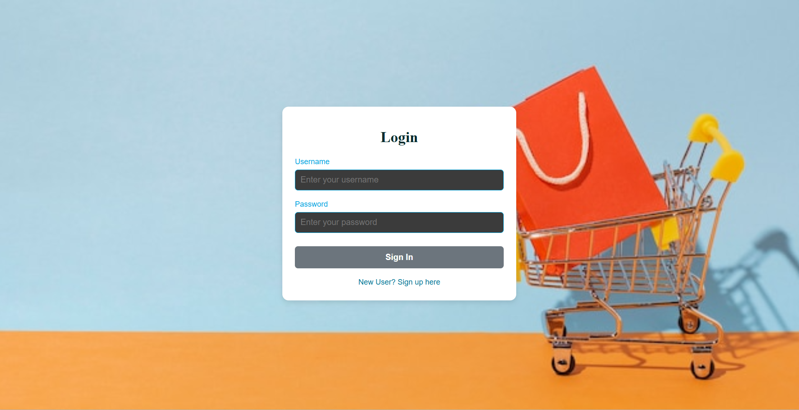
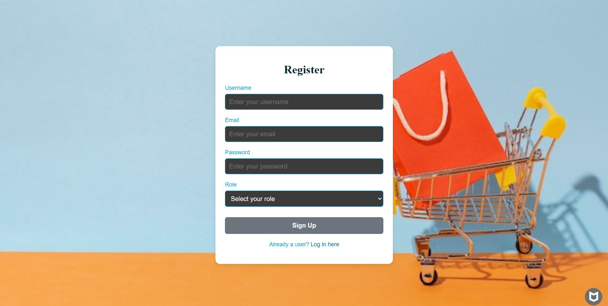
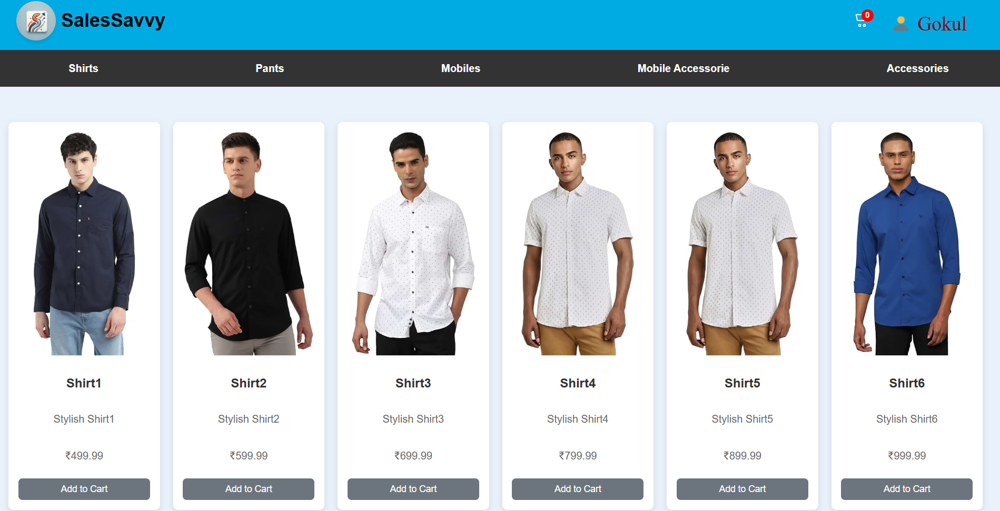
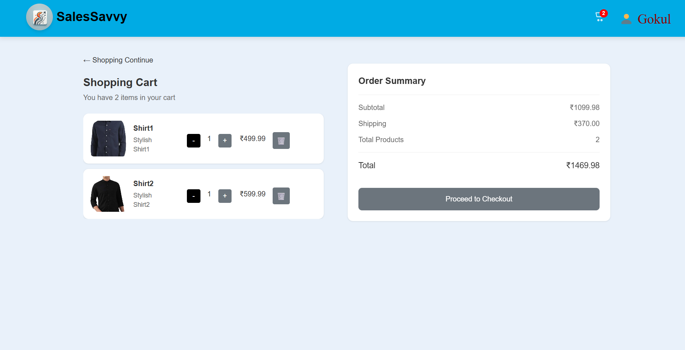
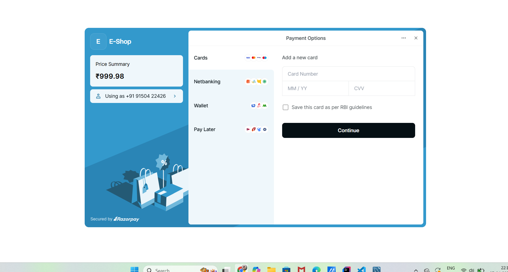
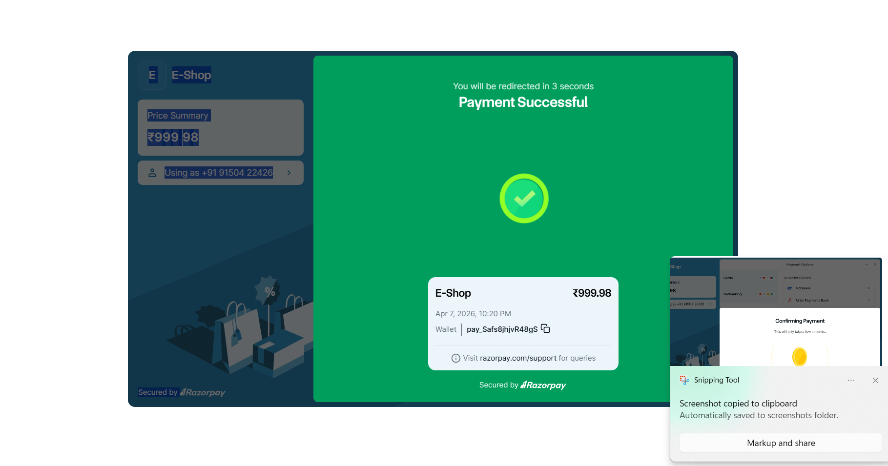

# 🛒🚀 SALES SAVVY 🚀🛒  

## 💻 A Full-Stack E-Commerce Platform  

### 🌐 Built with Spring Boot & React

🚀 Overview  
 SalesSavvy is a full-stack e-commerce web application designed to provide a smooth and secure online shopping experience. It is built using modern technologies to ensure performance, scalability, and user-friendly interaction.  
Users can browse products based on categories, view product details, add items to their cart, and complete purchases through secure online payments using Razorpay. The system is designed to handle real-world e-commerce functionalities efficiently.

🎯 FEATURES
- 🔐 User authentication (Signup & Login)  
- 🛍️ Explore products based on categories  
- 🛒 Add items to cart and manage quantity  
- 🔄 Update or remove items from cart  
- 💳 Secure payment integration using Razorpay  
- 📧 Email notifications for new user registration  
- ⚡ Fast, responsive, and user-friendly interface

# 🛠️ TECH STACK  

| Layer               | Technologies Used                          |
|--------------------|--------------------------------------------|
| ⚛️ Frontend        | React.js                                   |
| ⚙️ Backend         | Java, Spring Boot                          |
| 🗄️ Database        | MySQL                                      |
| 💳 Payment Gateway | Razorpay                                   |
| 📧 Email Service   | Brevo (SMTP)                               |
| 🛠️ Tools           | VS Code, Eclipse, Postman, Git, GitHub     |

📸 Screenshots

🔐 Login Page

Regitration Page 

Home Page

Cart Page

 📧 Notification Mail

 Payment Page

Payment Confirmation

📈 Future Enhancements / Admin Panel

🛒 Admin can add, update, or remove products  
📊 Admin can view daily, monthly, and yearly sales reports  
📦 Admin can track all orders and their status  
👥 Admin can manage user accounts and registrations  
🔔 Admin can get notifications for new orders or low stock 

## 🤝 Let’s Connect to Build More!
**Gokul M**  
🔗 [LinkedIn](https://www.linkedin.com/in/gokul-m-a92b64288) | ✉️[Email](mailto:mgokulmkg2003@gmail.com)

